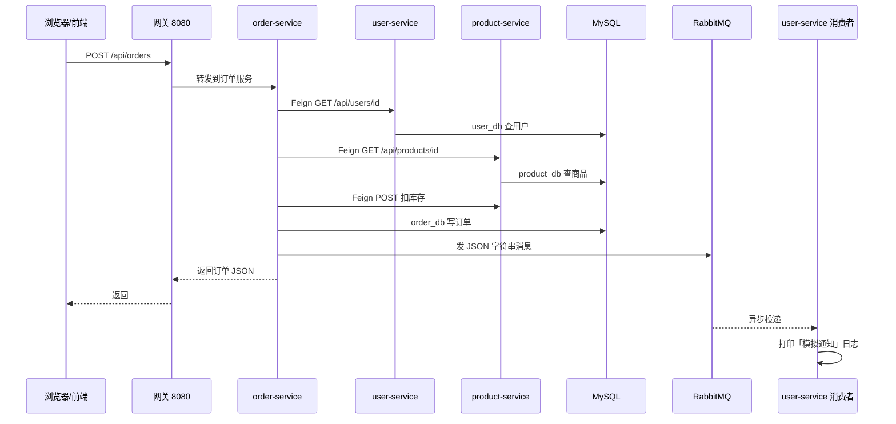

# 微服务入门（小白版）

给「刚把这个项目跑起来」的你：用**最少术语**把**微服务是什么**、**本项目里请求怎么流**、**代码在哪**说清楚。可以配合仓库里的代码一起看。

---

## 1. 微服务是什么？（先建立一个直觉）

想象一家餐厅：

- **单体应用**：一个厨师又切菜又炒菜又结账，所有事在一个程序里完成。简单，但人多了会乱、不好分工。
- **微服务**：**切菜一个组、炒菜一个组、收银一个组**，每组是**独立的小团队**，各干各的，通过**传话（接口）**协作。

在软件里：

- 每个「小团队」就是一个**独立运行的程序**（一个 Spring Boot 应用），一般叫**一个服务**。
- 它们**各自有数据库**（本仓库里：`user_db`、`product_db`……），**不共用一个库**，这样改用户模块不容易把订单表弄坏。
- 它们通过 **HTTP 接口**（或消息队列）互相调用，而不是在同一个进程里 `new` 对方。

**一句话**：微服务 = **把大系统拆成多个能独立部署的小程序，用网络调用连起来**。

---

## 2. 本仓库里「都有哪些块」？

你可以把它想成：**一个大门 + 电话簿 + 好几个柜台 + 一条传送带**。

| 块 | 比喻 | 在本项目里干什么 |
|----|------|-------------------|
| **网关 Gateway** | 大楼唯一正门 | 浏览器只访问 `8080`，它把 `/api/users` 转到用户服务、`/api/orders` 转到订单服务…… |
| **Nacos** | 电话簿 / 总台 | 每个服务启动时**登记**「我是谁、我在哪台机器哪个端口」；别人找「用户服务」时问 Nacos，不用写死 IP。 |
| **user / product / order / payment** | 各个柜台 | 各管一摊业务，**各连自己的 MySQL 库**。 |
| **RabbitMQ** | 传送带 / 留言板 | 订单创建后，发一条**消息**，用户服务**异步**收到，打日志模拟「发短信通知」（不必等用户服务处理完才返回下单结果）。 |
| **Docker Compose** | 给 MySQL、Nacos、MQ 搭好的房间 | 一键起中间件，你不用自己装一堆软件。 |

**前端 `frontend`**：只是方便点按钮，**不是微服务核心**；没有它，用 Postman 调网关一样可以。

---

## 3. 从浏览器到数据库：走一遍「创建订单」

下面按**时间顺序**，对应你项目里**真实发生的事**（略去细节错误处理）。

**用大白话对应代码：**

1. **你只打网关**  
   - 配置在：`gateway/src/main/resources/application.yml`（`/api/orders/**` → `lb://order-service`）。

2. **网关怎么找到订单服务？**  
   - `order-service` 启动时向 **Nacos** 注册（`spring.application.name: order-service`）。  
   - 网关用 **`lb://order-service`**：Nacos 告诉网关订单服务在 `127.0.0.1:8083`（示例）。

3. **订单服务里谁在干活？**  
   - 入口：`order-service/.../OrderController.java` → `OrderService.create(...)`。  
   - **Feign 客户端**：`UserClient.java`、`ProductClient.java`（像「打 HTTP 的接口」）。  
   - 顺序大致是：确认用户存在 → 读商品与库存 → 调商品服务扣库存 → 自己库写订单 → 发 MQ 消息。

4. **消息为什么用 JSON 字符串？**  
   - 见 `OrderService` 里 `objectMapper.writeValueAsString(msg)`。  
   - 默认 MQ 发 Java 对象容易踩坑，改成字符串，用户服务用 `String` 接收再 `readValue` 成自己的 `OrderCreatedMessage`（`OrderNotifyListener.java`）。

5. **用户服务为什么能收到？**  
   - `user-service/.../RabbitConfig.java` 里声明了**队列**绑定**交换机**和**路由键**，和订单服务发的交换机、路由键一致。

---

## 4. 「同步」和「异步」各是什么？

- **同步（Feign）**：订单服务**等**用户服务、商品服务**立刻回答**，再往下走。慢的一步会拖慢整个下单接口。  
  - 代码：`order-service` 里的 `UserClient`、`ProductClient`。

- **异步（MQ）**：订单服务**发完消息就继续返回给浏览器**，不用等「通知用户」做完。  
  - 代码：`rabbitTemplate.convertAndSend` + `OrderNotifyListener`。

---

## 5. 支付服务在流程里干什么？

- **payment-service** 用 **Feign** 调订单：`GET /api/orders/{id}` 看金额和状态，再 `POST /api/orders/{id}/pay` 把订单改成已支付，同时自己库写一条支付记录。  
- 这是**又一次「服务间 HTTP」**，和下单类似，只是业务变成「付钱」。

---

## 6. 代码目录「谁负责什么」（按模块扫一眼）

| 路径 | 干什么 |
|------|--------|
| `gateway/` | 只有路由 + 注册到 Nacos，几乎没业务逻辑。 |
| `user-service/` | 用户表、注册登录式创建用户、缓存、MQ 监听。 |
| `product-service/` | 商品表、列表、扣库存接口。 |
| `order-service/` | 订单表、Feign、发 MQ、查询订单、确认支付。 |
| `payment-service/` | 支付表、Feign 调订单。 |
| `frontend/` | Vue 页面，可选。 |
| `docker-compose.yml` | MySQL / Redis / RabbitMQ / Nacos。 |
| `docker/mysql/init/` | 建库脚本（表由各服务 **Flyway** 启动时创建）。 |

---

## 7. 项目里的代码「都有用吗」？能精简吗？

**核心学习路径（建议都保留）：**  
网关、Nacos、四个业务服务、各自 Flyway、下单 Feign 链路、MQ 通知、支付服务——**这些是「微服务长什么样」的主体**。

**可以视为「增强体验」，删了仍能讲微服务，但少点直观：**

- **`frontend/`**：没有也能用 Postman；留着适合点点按钮。  
- **`payment-service/`**：最小闭环可以只有「用户 + 商品 + 订单」；支付是**多一个拆分维度**的练习。  
- **Docker 里的 Redis**：当前 Java 业务**没有必须依赖 Redis**（缓存用的是 Caffeine）；Compose 里的 Redis 主要是**预留**你以后接 `RedisTemplate` 或练手。想极简可以以后从 `docker-compose.yml` 里删掉 redis 服务（需同步改 README 端口说明）。

**已经帮你去掉的一点：**  
`UserService.exists(...)` 曾经写了但**没有任何地方调用**，属于死代码，已从仓库删除。

---

## 8. 你还可以怎么学？

1. **只开一个服务 + Nacos + MySQL**，看 Nacos 里注册名。  
2. **用断点**打在 `OrderService.create`，一步一步看 Feign 怎么进用户服务、商品服务。  
3. **关掉 user-service**，再下单，看 Feign 报错——体会「依赖另一个服务」的感觉。  
4. 打开 **RabbitMQ 管理界面**，下单后看队列里消息有没有。

---

## 9. 和「真·生产」差在哪？（心里有数即可）

真实环境还会常见：**统一登录、限流熔断、链路追踪、配置中心、K8s 部署、多实例扩缩容**等。本仓库刻意**先让你跑通主链路**，再去看 Sentinel、SkyWalking 等扩展。

---

若你愿意，下一步可以指定「只保留三个服务」或「画一张只含同步链路的图」，我可以按你的目标再缩一版说明或目录建议（不直接大删业务模块，除非你确认要删）。
